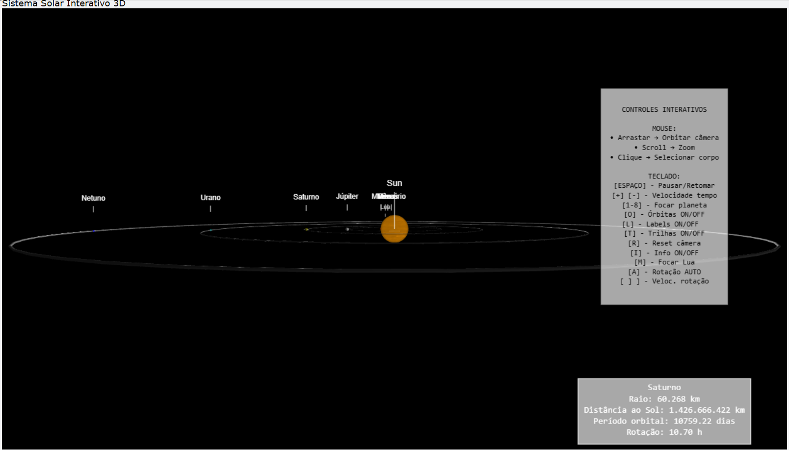

# 🌌 Sistema Solar 3D  

---



## Descrição do Projeto
Este projeto é uma simulação interativa do **Sistema Solar em 3D**, desenvolvida em **Python** utilizando a biblioteca [VPython](https://vpython.org/).  

A aplicação exibe os planetas orbitando o Sol, permitindo **interação via mouse e teclado**, além de apresentar informações detalhadas de cada corpo celeste.  

> O projeto foi desenvolvido como **Trabalho Final da 2ª VA** da disciplina de **Computação Gráfica**.

---

## Requisitos Atendidos
- **3D**: Visualização tridimensional com rotação, zoom e movimentação de câmera.  
- **Interação**:  
  - **Mouse** → arrastar (orbitar), scroll (zoom), clique em planetas.  
  - **Teclado** → pausar/retomar, focar em planetas, alternar órbitas, trilhas e labels.  
- **Estrutura de Dados**:  
  - Classe `Planet` e classe `Moon`.  
  - Lista de planetas (`planets`).  
  - Dicionários de configuração com dados astronômicos (raio, distância, período).  
- **Extra**:  
  - Textura aplicada à Terra.  
  - Luz local no Sol (efeito de iluminação).  
  - Trilhas, labels e anéis de Saturno.  

---

## Controles

- **Mouse**:  
  - Arrastar → orbitar câmera.  
  - Scroll → zoom.  
  - Clique em planeta → foco + painel de informações.  

- **Teclado**:  
  - `Espaço` → Pausa/Retoma simulação.  
  - `+` / `-` → Acelera/Desacelera tempo.  
  - `1..8` → Focar em Mercúrio … Netuno.  
  - `O` → Mostrar/Ocultar órbitas.  
  - `L` → Mostrar/Ocultar labels.  
  - `T` → Ativar/Desativar trilhas.  
  - `R` → Resetar câmera para o Sol.  
  - `I` → Mostrar/Ocultar painel de informações.  

---

## Requisitos de Execução
- **Python 3.9+** (testado no **Python 3.11**)  
- Biblioteca **VPython**  

Instalação da dependência:
```bash
python -m pip install vpython
````

---

## Execução

Na pasta do projeto, execute:

```bash
python solar_system_vpython.py
```

---

## Estrutura do Projeto

```
sistema-solar/
│
├── solar_system_vpython.py # Código principal da simulação
├── README.md # Documentação do projeto
└── img/ # Pasta de imagens
    └── sistemaSolar.png # Imagem do sistema solar          
```

---


## Autoras

* [Yasmin da Silva Muniz](https://github.com/Yasmiinmuniz)
* [Luana Brito](https://github.com/LuBrito371)
